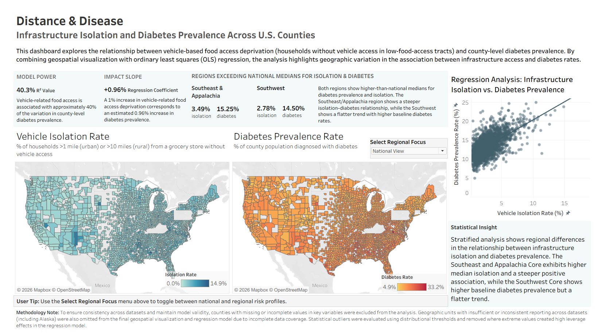
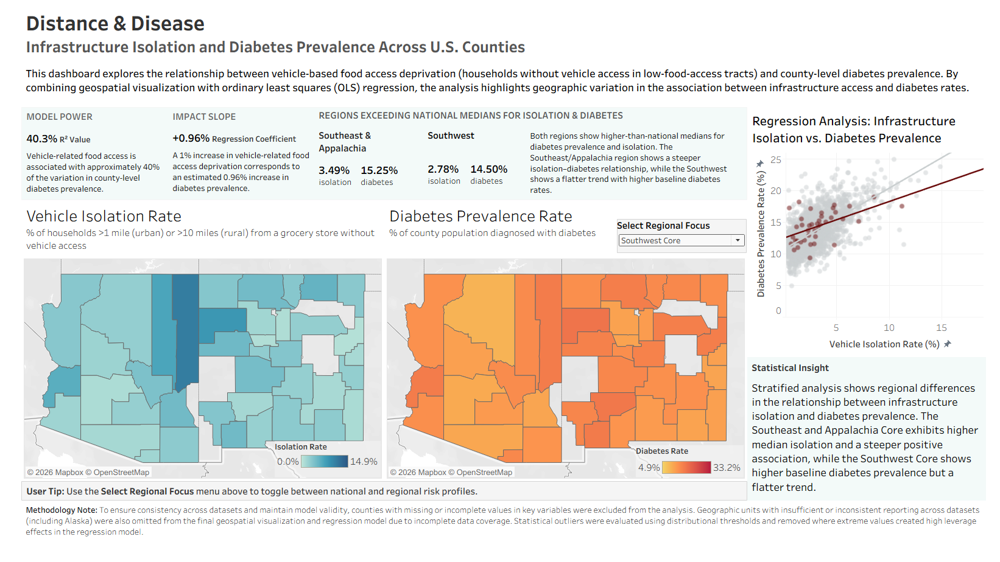
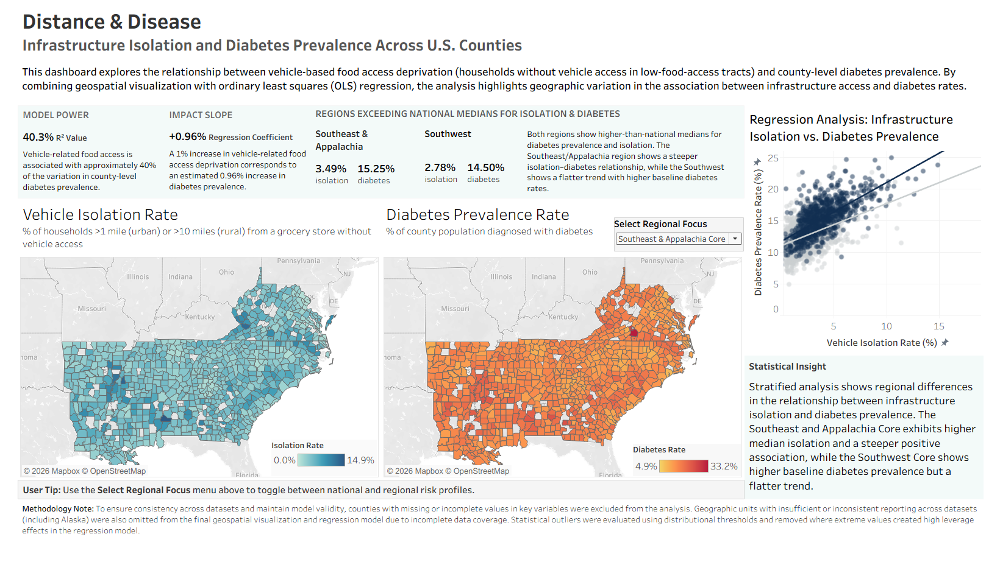

# Distance & Disease

### Spatial Disparities in Public Health: Infrastructure Isolation and Diabetes Prevalence Across U.S. Counties

## Dashboard Preview
<p align="center">
  
  <br>
  <i>Figure 1: National Interactive BI Dashboard: Mapping Infrastructure Barriers vs. Crude Diabetes Prevalence</i>
</p>

## Executive Summary

This project investigates the relationship between transportation-related food access barriers and diabetes prevalence across U.S. counties.

Using county-level data from the USDA Food Environment Atlas and CDC PLACES datasets, I developed an end-to-end analytics pipeline incorporating SQL, SQLite, Python, statistical modeling, and Tableau. The analysis examined whether communities with larger populations experiencing both low food access and limited vehicle access tend to exhibit higher rates of diabetes.

Results revealed a moderate-to-strong positive relationship between infrastructure isolation and diabetes prevalence, with the final regression model explaining approximately 40% of observed variation in county diabetes rates. Regional analysis further identified elevated burdens in the Southeast/Appalachia and Southwest regions, while revealing meaningful geographic differences in the strength of the observed relationship.

---

## Research Question

**Is there a measurable relationship between transportation-related food access barriers and county-level diabetes prevalence in the United States?**

Specifically, this analysis focuses on the percentage of county residents who:

* Live in areas with low food access
* Do not have access to a vehicle

and evaluates how this metric relates to county diabetes prevalence.

---

## Data Sources

### USDA Food Environment Atlas (Updated July 2025)

Provides county-level indicators related to food access, food environments, and socioeconomic conditions.

### CDC PLACES: Local Data for Better Health (2025 Release)

Provides county-level estimates of chronic disease prevalence and health outcomes.

---

## Tools & Technologies

* SQL
* SQLite
* Python
* Pandas
* NumPy
* Seaborn
* Matplotlib
* Statsmodels
* Tableau

---

## Project Workflow

### 1. Data Integration

* Imported USDA and CDC datasets into SQLite.
* Created SQL queries to extract relevant variables.
* Joined datasets using geographic identifiers.
* Standardized county FIPS codes to preserve geographic join integrity.

### 2. Data Cleaning & Preparation

* Audited missing values and data completeness.
* Investigated geographic patterns in missing data.
* Removed records with incomplete data for selected variables.
* Validated county-level records for modeling and visualization.

### 3. Exploratory Data Analysis

* Generated descriptive statistics.
* Built correlation matrices and heatmaps.
* Investigated geographic patterns through mapping and visualization.
* Evaluated relationships between multiple food environment variables and diabetes prevalence.

### 4. Feature Selection

Several food environment variables were evaluated during exploratory analysis, including:

* Low-income, low-food-access population
* Low-food-access population without vehicle access
* Convenience store density
* Fast food restaurant density
* Healthy food retailer density
* Obesity prevalence

The percentage of residents experiencing both low food access and no vehicle access demonstrated the strongest relationship with diabetes prevalence and was selected as the primary explanatory variable for modeling.

### 5. Outlier Investigation

Several counties exhibited unusually high rates of transportation isolation but comparatively low diabetes prevalence. Further investigation revealed that these observations were concentrated in counties with large Amish populations, where low vehicle ownership reflects cultural practices rather than transportation disadvantage.

After evaluating their influence on the model, these counties were excluded from the final analysis, strengthening the observed relationship between infrastructure isolation and diabetes prevalence.

### 6. Statistical Modeling

* Calculated Pearson correlation coefficients.
* Built an Ordinary Least Squares (OLS) regression model.
* Evaluated residual diagnostics and model assumptions.
* Tested logarithmic transformation as a variance stabilization technique.
* Compared model performance before and after transformation.

### 7. Dashboard Development

* Created an interactive Tableau dashboard to visualize national and regional patterns.
* Incorporated choropleth maps, KPI cards, scatterplots, and regional comparisons.
* Developed regional cohort analysis for the Southeast/Appalachia and Southwest regions.

---

## Key Findings

### National Relationship

A moderate-to-strong positive relationship was observed between transportation-related food access barriers and diabetes prevalence.

* Correlation coefficient: **r = 0.63**
* OLS model R²: **0.403**

The final model suggests that:

> For every 1 percentage-point increase in the population experiencing both low food access and limited vehicle access, county diabetes prevalence increased by approximately 0.96 percentage points.

### Regional Patterns

Regional analysis identified two notable clusters with elevated infrastructure isolation and diabetes prevalence:

#### Southeast & Appalachia

* Median Infrastructure Isolation: **3.49%**
* Median Diabetes Prevalence: **15.25%**
* Counties analyzed: **796**

#### Southwest

* Median Infrastructure Isolation: **2.78%**
* Median Diabetes Prevalence: **14.50%**
* Counties analyzed: **40**

Both regions exceeded national median levels of infrastructure isolation (2.55%) and diabetes prevalence (13.20%).

Regional stratification further revealed that the relationship between infrastructure isolation and diabetes prevalence was stronger in the Southeast/Appalachia cohort than in the Southwest cohort, suggesting that the impact of transportation-related food access barriers may vary across geographic regions.

## Dashboard Preview

<p align="center">
  
  <br>
  <i>Figure 2: Southeast & Appalachian Cohort: Visualizing the Elevated Vertical Metabolic Risk Plane</i>
</p>

<p align="center">
  
  <br>
  <i>Figure 3: Southwest Regional Cohort — Visualizing Baseline Compression and Downward Intercept Shift</i>
</p>

---

## Model Evaluation

Residual diagnostics indicated moderate skewness and some heteroscedasticity, which is common in large public health datasets.

A logarithmic transformation was tested to improve model assumptions; however:

* Model fit decreased from **R² = 0.403** to **R² = 0.307**
* Residual distributions became more distorted

As a result, the original linear model was retained due to its stronger explanatory performance and greater interpretability.

---

## Tableau Dashboard

The Tableau dashboard complements the statistical analysis by providing:

* County-level choropleth maps
* Infrastructure isolation visualizations
* Diabetes prevalence mapping
* Regional comparisons
* Interactive filtering and exploration

**Interactive Dashboard**

https://public.tableau.com/views/USInfrastructureBarriersRegionalDiabetesRisk_twbx/DistanceDiseaseDashboard?:language=en-US&:sid=&:redirect=auth&:display_count=n&:origin=viz_share_link

---

## Limitations

* Correlation does not imply causation.
* The model is intentionally univariate and does not account for additional socioeconomic, demographic, or healthcare-access factors.
* Regional differences suggest that additional variables may influence diabetes prevalence beyond transportation-related food access barriers.
* Findings should be interpreted as associations rather than causal effects.

---

## Skills Demonstrated

### Data Engineering

* SQL querying and joins
* Relational database workflows using SQLite
* Data integration across multiple public datasets
* Geographic key standardization (FIPS codes)

### Data Analysis

* Data cleaning and preprocessing
* Exploratory data analysis
* Feature selection
* Outlier investigation
* Statistical modeling and regression analysis
* Model diagnostics and validation

### Data Visualization

* Seaborn and Matplotlib visualizations
* Tableau dashboard development
* Geospatial mapping
* KPI and executive dashboard design

### Domain Knowledge

* Public health data interpretation
* Social determinants of health analysis
* Geographic disparity analysis

## Repository Structure

```text
food-access-diabetes-analysis/
│
├── data/
│   ├── StateAndCountyData
│   └── PLACES__Local_Data_for_Better_Health,_County_Data,_2025_release_20260522
│
├── 01_data_extraction.sql
├── 02_exploratory_analysis.ipynb
├── 03_food_access_diabetes_model_output
├── 04_distance_and_disease_dashboard.twbx
│
└── README.md
```

### File Guide

| File                                     | Description                                                                                                                                    |
| ---------------------------------------- | ---------------------------------------------------------------------------------------------------------------------------------------------- |
| `01_data_extraction.sql`                 | SQL queries used to extract, clean, and join USDA Food Environment Atlas and CDC PLACES datasets within SQLite.                                |
| `02_exploratory_analysis.ipynb`          | Jupyter Notebook containing data cleaning, exploratory data analysis, statistical modeling, outlier investigation, and regression diagnostics. |
| `03_food_access_diabetes_model_output`   | Exported analytical results and model outputs generated from the final regression analysis.                                                    |
| `04_distance_and_disease_dashboard.twbx` | Interactive Tableau dashboard visualizing national and regional patterns in infrastructure isolation and diabetes prevalence.                  |
| `README.md`                              | Project overview, methodology, findings, and documentation.                                                                                    |

```


```
